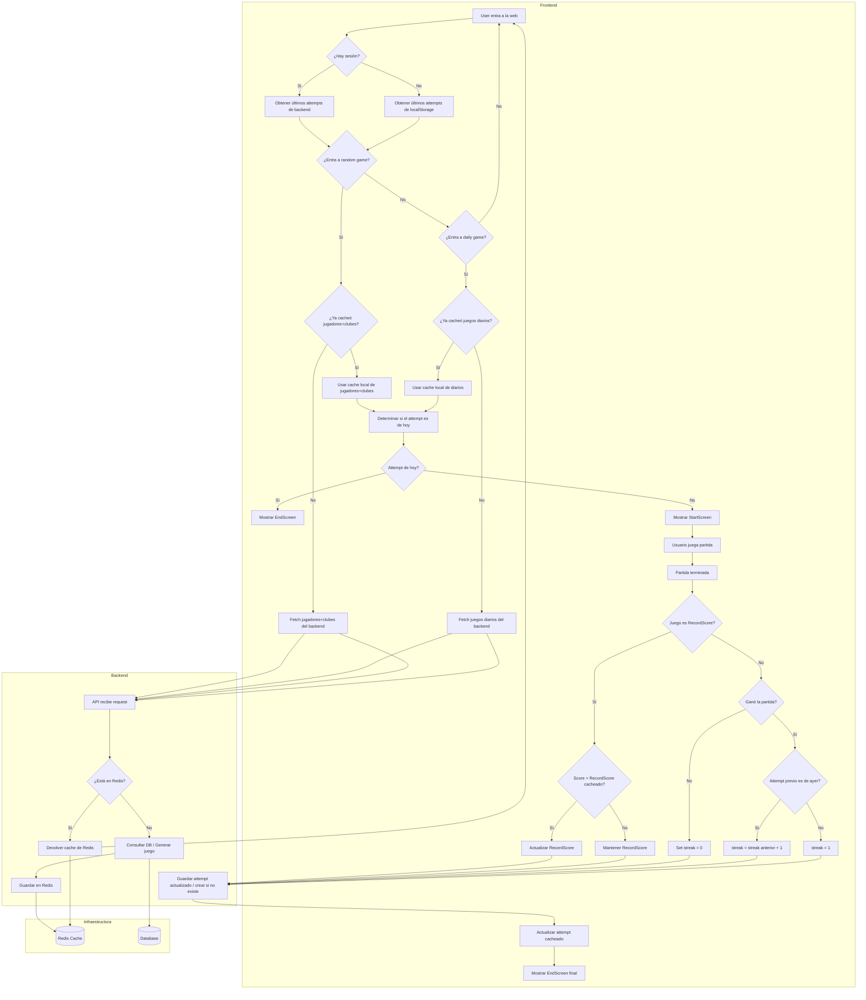

```mermaid
 flowchart TD

%% =====================
%% FRONTEND
%% =====================
subgraph Frontend
    A[User entra a la web]
    B{¿Hay sesión?}
    C[Obtener últimos attempts de backend]
    D[Obtener últimos attempts de localStorage]

    E{¿Entra a random game?}
    F{¿Ya cacheó jugadores+clubes?}
    G[Fetch jugadores+clubes del backend]
    H[Usar cache local de jugadores+clubes]

    I{¿Entra a daily game?}
    J{¿Ya cacheó juegos diarios?}
    K[Fetch juegos diarios del backend]
    L[Usar cache local de diarios]

    %% Nuevo: flow de juego
    AA[Determinar si el attempt es de hoy]
    AB{Attempt de hoy?}
    AC[Mostrar EndScreen]
    AD[Mostrar StartScreen]
    AE[Usuario juega partida]
    AF[Partida terminada]
    AG{Juego es RecordScore?}
    AH{Score > RecordScore cacheado?}
    AI[Actualizar RecordScore]
    AJ[Mantener RecordScore]
    AK{Ganó la partida?}
    AL[Set streak = 0]
    AM{Attempt previo es de ayer?}
    AN[streak = streak anterior + 1]
    AO[streak = 1]
    AP[Actualizar attempt cacheado]
    AQ[Mostrar EndScreen final]
end

%% =====================
%% BACKEND
%% =====================
subgraph Backend
    M[API recibe request]
    N{¿Está en Redis?}
    O[Devolver cache de Redis]
    P[Consultar DB / Generar juego]
    Q[Guardar en Redis]
    T[Guardar attempt actualizado / crear si no existe]
end

%% =====================
%% INFRASTRUCTURA
%% =====================
subgraph Infraestructura
    R[(Redis Cache)]
    S[(Database)]
end

%% =====================
%% FLUJO PRINCIPAL
%% =====================
A --> B
B -->|Sí| C
B -->|No| D

C --> E
D --> E

E -->|Sí| F
E -->|No| I

F -->|No| G
F -->|Sí| H

G --> M
H --> AA
I -->|Sí| J
I -->|No| A

J -->|No| K
J -->|Sí| L

K --> M
L --> AA

%% =====================
%% JUEGO Y ATTEMPTS
%% =====================
AA --> AB
AB -->|Sí| AC
AB -->|No| AD

AD --> AE --> AF --> AG

%% RecordScore branch
AG -->|Sí| AH
AH -->|Sí| AI --> T
AH -->|No| AJ --> T

%% Streak branch
AG -->|No| AK
AK -->|No| AL --> T
AK -->|Sí| AM
AM -->|Sí| AN --> T
AM -->|No| AO --> T

T --> AP --> AQ

%% =====================
%% BACKEND CACHE FLOW
%% =====================
G --> M
K --> M
M --> N
N -->|Sí| O
N -->|No| P
O --> A
P --> Q --> R
P --> S
O --> R

```
